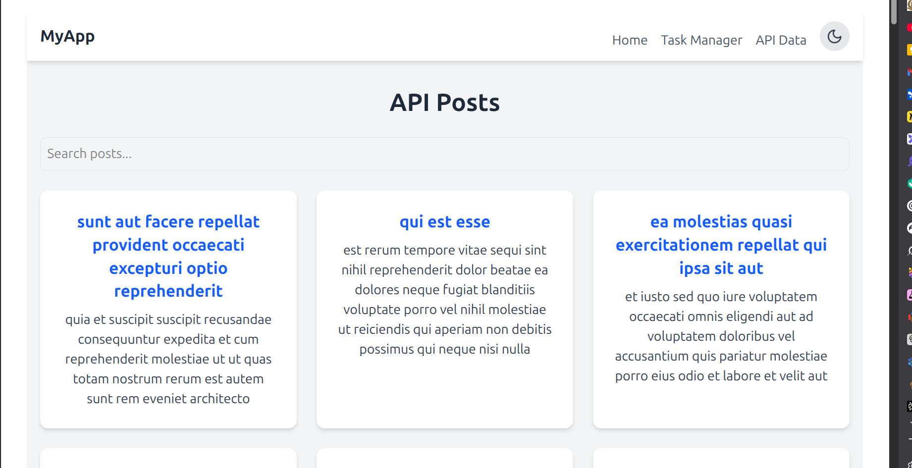
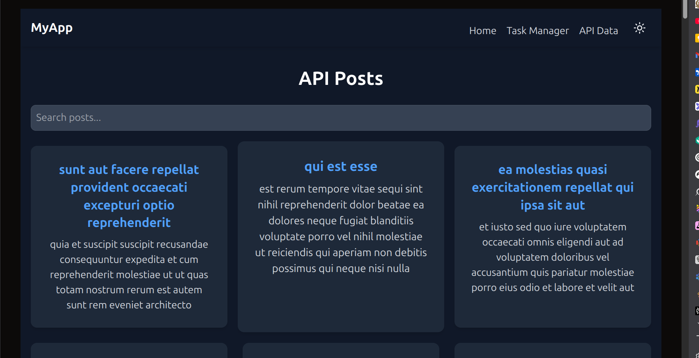

# Week 3 React & Tailwind Assignment

This project is a responsive React application built with Vite and styled with Tailwind CSS. It demonstrates key concepts like component architecture, state management with hooks, API integration, and theming.

## Live Demo

[Link to your deployed application on netflify/vercel](https://my-react-app-sand-eight.vercel.app/)

## Features
- Reusable UI Components (Button, Card, Layout)
- Task Manager with Add, Delete, Complete, and Filter functionality
- Persistent state using a custom `useLocalStorage` hook
- Light/Dark mode theme switching with `useContext`
- API data fetching from JSONPlaceholder with loading/error states
- Live search/filter for API data
- Fully responsive design for mobile, tablet, and desktop

## Tech Stack
- React.js
- Vite
- Tailwind CSS
- React Router

## Setup and Installation

1. Clone the repository:
   ```bash
   git clone <your-repo-url>
   ```
2. Navigate to the project directory:
   ```bash
   cd <your-repo-name>
   ```
3. Install dependencies:
   ```bash
   npm install
   ```
4. Start the development server:
   ```bash
   npm run dev
   ```

## Screenshots

### Light Mode


### Dark Mode
